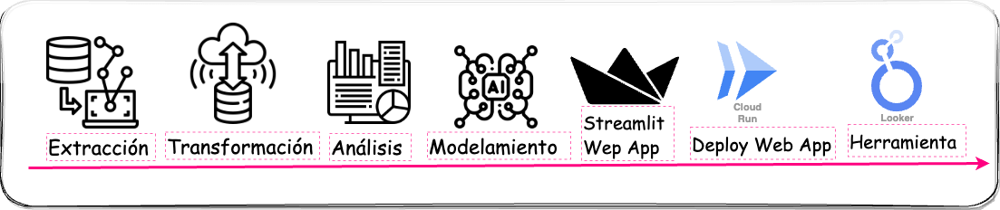

# Herramienta de Análisis Predictivo de Contratación Eficiente - Instituto Nacional Penitenciario y Carcelario (INPEC)


Este proyecto implementa una herramienta integral, tanto descriptiva como predictiva, que optimiza la gestión de contratación dentro del INPEC. Esta herramienta ofrece una visualización comprensible del análisis descriptivo basado en el registro histórico del SECOP. Adicionalmente, dispone de una funcionalidad predictiva que estima la probabilidad de una adición presupuestaria, determina el monto recomendado para dicha adición, calcula la probabilidad de extensión del contrato y sugiere el número de días adecuados para una prórroga.

##### Table of Contents  
[Información general](#informacion_general)  
[Tecnologías](#tecnologias) 
[Ejecutar localmente](#ejecutarlocal)  
[Autores](#contacto) 
[Contacto](#contacto)
   
## Información general


La herramienta fue desarrollada como proyecto final de la Maestría en Inteligencia Analítica para la Toma de Decisiones. El proyecto se desarrollo en varias partes: 

1. **Extracción:** extracción de los datos historicos por medio de una conexión al API del SECOP I Y II.
2. **Transformación:** normalización de los datos, creación de nuevas variables, filtro de datos, limpieza y proceso de scrambling para valores faltantes. Adicionalmente el resultado de este proceso ETL se envio a BigQuery como el data warehose de los datos.
3. **Análisis:** análisis exploratorio y  análisis descriptivo de los datos.
4. **Modelamiento:** aplicación de métodos para determinar la importancia de las características en las variables de salida de los modelos. Implementación de modelos de regresión, clasificación y redes neuronales, además de la ejecución de procesos de optimización y validación de resultados.
5. **Streamlit Web App:** se implementó una aplicación web Streamlit para la visualización y ejecución de modelos encargados de realizar predicciones sobre las variables de interés.
6. **Deploy Web App:** se ha desplegado una instancia de ``Cloud Run`` en la nube de Google Cloud Platform (GCP), la cual asumirá la responsabilidad de ejecutar la herramienta web a través de una URL pública. El objetivo de esta implementación es gestionar el servicio de manera más eficiente y simplificar su uso.
7. **Desarrollo Herramienta:** la herramienta final se diseñó utilizando Looker Studio, donde se implementó un análisis descriptivo y se incorporó a una aplicación web de predicción.

## Tecnologías
El proyecto se creo con:

* `Streamlit` para el desarrollo de aplicaciones web.
* `Sklearn`, `LightGBM`, `XGBoost` y `Keras` para el desarrollo de modelos de aprendizaje automático.
* `Pandas` para el procesamiento de datos.
* ``GCP-Cloud Run``: para el despliegue e infraestructura del app.

## Ejecutar localmente - App Web
Clonar el respositorio

```bash
  git clone https://github.com/njimenez92/proyecto-grado-miad.git
```

Ir a la carpeta donde clono el repositorio

```bash
  cd /proyecto-grado-miad
```

Instalar dependencias

```bash
  pip install -r requirements.txt
```

Inicie el localment el `App Streamlit`

```bash
  streamlit run app_tool/app.py
```

## Herramienta final 
El enlace a continuación lleva al tablero completo de la herramienta. Este tablero integra tanto elementos predictivos como descriptivos para proporcionar una visión completa y detallada del producto final.

- [Herramienta-Final](https://lookerstudio.google.com/u/0/reporting/bcc04777-e44e-47cb-95fa-492c884c6b4a/page/4HOOD)

## Autores
- [Natalia Jiménez](https://github.com/njimenez92)
- [Maria José Baquero](https://github.com/majobaqueroj26)
- [Mario Rivera](https://github.com/marioriveravargas)
## Contacto
Puede informar cualquier problema [aquí](https://github.com/njimenez92/proyecto-grado-miad/issues). Para cualquier consulta o sugerencia adicional, no dude en comunicarse.

